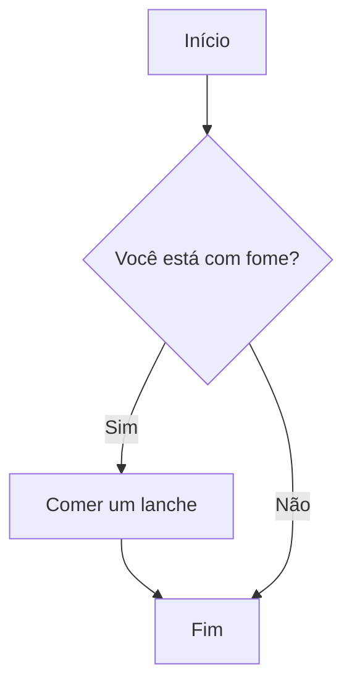
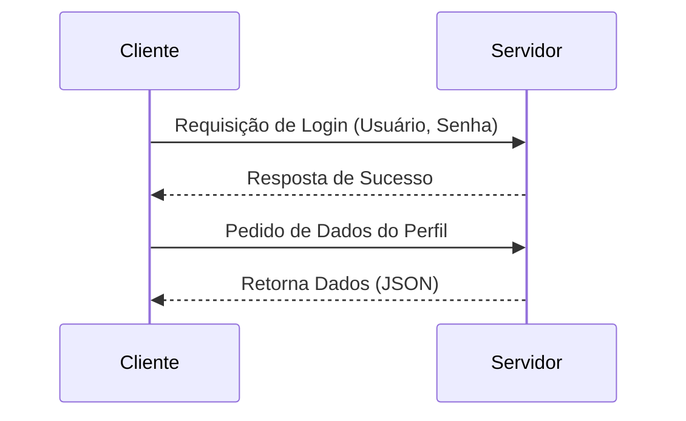
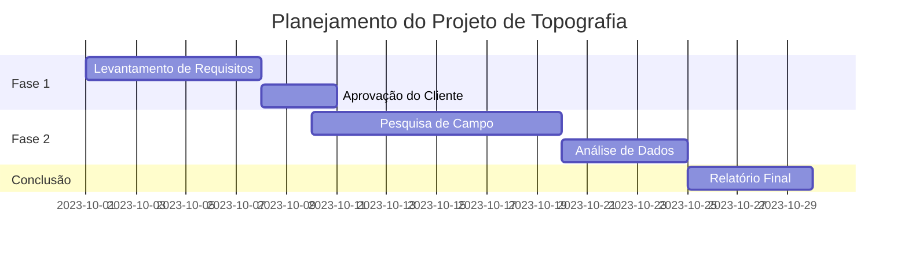
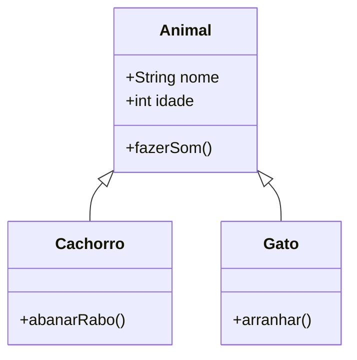

# Guia Rápido do Mermaid

O **Mermaid** é uma ferramenta baseada em JavaScript que utiliza uma sintaxe semelhante ao Markdown para criar diagramas e fluxogramas complexos de forma simples e renderizá-los diretamente no navegador. Muitas plataformas, incluindo o GitHub, já oferecem suporte nativo para a visualização de diagramas escritos em Mermaid.

Este guia prático cobre alguns dos tipos de diagramas mais comuns e úteis.

## 1. Fluxogramas (Flowcharts)

Fluxogramas são excelentes para representar processos, decisões e o fluxo de um sistema.

### Como criar
Para criar um fluxograma, você deve definir a direção do fluxo:
- `TD` ou `TB`: Cima para Baixo (Top Down ou Top Bottom)
- `BT`: Baixo para Cima (Bottom Top)
- `RL`: Direita para Esquerda (Right Left)
- `LR`: Esquerda para Direita (Left Right)

### Exemplo de Código

## 2. Diagramas de Sequência (Sequence Diagrams)

Diagramas de Sequência mostram como os processos interagem entre si e em qual ordem. Eles são muito utilizados para descrever a comunicação entre sistemas ou atores.

### Como criar
Você define os `participant` ou `actor` e usa setas (`->>`) para indicar a troca de mensagens, que pode ser síncrona ou assíncrona.

### Exemplo de Código

## 3. Gráficos de Gantt (Gantt Charts)

Gráficos de Gantt são extremamente úteis para o planejamento e gerenciamento de projetos, exibindo tarefas, durações e dependências ao longo de uma linha do tempo.

### Como criar
Você deve definir o formato das datas e agrupar as tarefas por `section`.

### Exemplo de Código

## 4. Diagramas de Classe (Class Diagrams)

Diagramas de classe descrevem a estrutura de um sistema através das classes, seus atributos, métodos e os relacionamentos entre os objetos.

### Como criar
Você define a classe e pode listar propriedades, métodos e relações como herança ou composição.

### Exemplo de Código

## Referências Úteis

* [Documentação Oficial do Mermaid](https://mermaid.js.org/)
* [Live Editor do Mermaid](https://mermaid.live/) (Excelente para testar seus diagramas antes de colocá-los no código).
