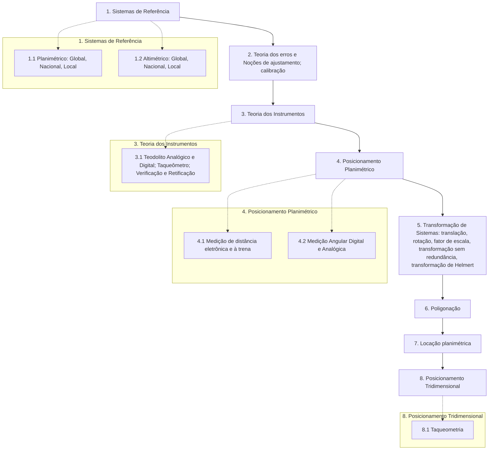

# Estrutura do Assunto - Topografia 9

Abaixo está o diagrama em Mermaid que descreve a sequência de aulas e conteúdos baseada no plano de ensino da disciplina.

```mermaid
graph TD
    A[1. Sistemas de Referência] --> B[2. Teoria dos erros e Noções de ajustamento; calibração]

    subgraph S1 [1. Sistemas de Referência]
        A1[1.1 Planimétrico: Global, Nacional, Local]
        A2[1.2 Altimétrico: Global, Nacional, Local]
    end

    A -.-> A1
    A -.-> A2

    B --> C[3. Teoria dos Instrumentos]

    subgraph S3 [3. Teoria dos Instrumentos]
        C1[3.1 Teodolito Analógico e Digital; Taqueômetro; Verificação e Retificação]
    end

    C -.-> C1

    C --> D[4. Posicionamento Planimétrico]

    subgraph S4 [4. Posicionamento Planimétrico]
        D1[4.1 Medição de distância eletrônica e à trena]
        D2[4.2 Medição Angular Digital e Analógica]
    end

    D -.-> D1
    D -.-> D2

    D --> E[5. Transformação de Sistemas: translação, rotação, fator de escala, transformação sem redundância, transformação de Helmert]

    E --> F[6. Poligonação]

    F --> G[7. Locação planimétrica]

    G --> H[8. Posicionamento Tridimensional]

    subgraph S8 [8. Posicionamento Tridimensional]
        H1[8.1 Taqueometria]
    end

    H -.-> H1
```
