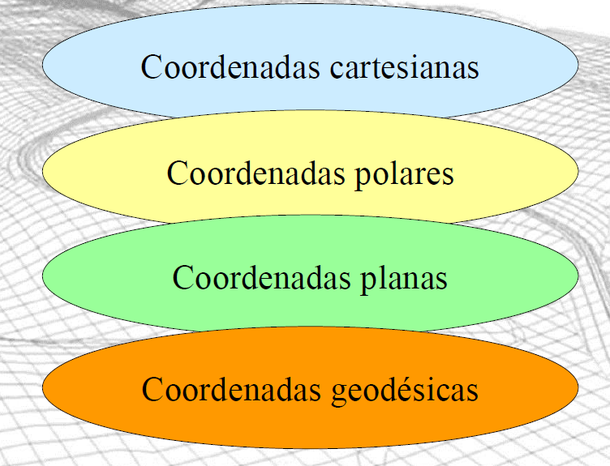

# Continuação da Aula 01

***

## IMPORTÂNCIA DA GEOMÁTICA

**Aula 1 - Continuação**

_Papel da Geomática na Engenharia: mensuração, representação do terreno e suporte a decisões técnicas._

**Autor:** Prof. Erison Rosa de Oliveira Barros

***

### &#x20;Mensuração na Engenharia

#### Fundamentos da Engenharia

Como parte de suas atribuições, o engenheiro depara-se frequentemente com situações nas quais necessita:

🎯 **Determinar posições relativas de pontos**

* Localização de pontos sobre a superfície terrestre ou próximo dela
* Base para todos os trabalhos de mensuração

📐 **Representar o espaço**

* Plantas, cartas, mapas, modelos digitais de terreno (MDT)
* Perfis e outras formas de representação gráfica

⚠️ **Problemas de mensuração**

* Exigem precisão, referências e padronização
* Complexidade varia conforme a aplicação

🌍 **Integração da Geomática**

* Métodos, sensores e sistemas integrados
* Medir e representar com eficiência e qualidade

***

### &#x20;Principais Aplicações da Geomática

#### Fundamentos da Engenharia

**01. Determinação de coordenadas de pontos**

* Posicionamento planimétrico e altimétrico
* Métodos trigonométricos e poligonométricos

<figure><figcaption></figcaption></figure>

**02. Implantação de pontos de controle**

* Referência para levantamentos e projetos
* Amarração à rede geodésica oficial

<figure><figcaption></figcaption></figure>

**03. Levantamento de detalhes e perfis**

* Cadastro de elementos do terreno
* Perfis longitudinais e transversais

**04. Auscultação de obras de engenharia**

* Monitoramento de deformações estruturais
* Controle de recalques e deslocamentos

<figure><figcaption></figcaption></figure>

<figure><figcaption></figcaption></figure>

<figure><figcaption></figcaption></figure>

<figure><figcaption></figcaption></figure>

<figure><figcaption></figcaption></figure>

<figure><figcaption></figcaption></figure>

<figure><figcaption></figcaption></figure>

<figure><figcaption></figcaption></figure>

<figure><figcaption></figcaption></figure>

<figure><figcaption></figcaption></figure>

<figure><figcaption></figcaption></figure>

**05. Determinação de diferenças de nível**

* Nivelamento geométrico, trigonométrico e por GNSS
* Transporte de cotas de referência

**06. Construção civil e produtos cartográficos**

* Suporte a projetos de engenharia
* Produção de mapas e cartas técnicas

### Mapa

<figure><figcaption></figcaption></figure>

***

### Carta&#x20;

<figure><figcaption></figcaption></figure>

<figure><figcaption></figcaption></figure>

<figure><figcaption></figcaption></figure>

<figure><figcaption></figcaption></figure>

### Sistemas de Coordenadas

#### Fundamentos da Geomática

<figure><figcaption></figcaption></figure>

**Coluna Esquerda: Tipos de Coordenadas**

**Cartesianas (X, Y, Z)**

* Eixos ortogonais tridimensionais
* Sistema mais intuitivo para cálculos espaciais

**Polares (d, β)**

* Distância e ângulo a partir de uma origem
* Usado em levantamentos topográficos

**Planas (E, N)**

* Coordenadas retangulares em projeção cartográfica
* Sistema UTM no Brasil

**Geodésicas (φ, λ, h)**

* Latitude, longitude e altura no elipsóide
* Padrão para posicionamento por GNSS

**Coluna Direita: Considerações**

A escolha do sistema de coordenadas afeta:

* Precisão das medições
* Complexidade dos cálculos
* Compatibilidade com outros sistemas
* Representação cartográfica adequada

***

### Rede Geodésica e Pontos de Controle

<figure><figcaption></figcaption></figure>

<figure><figcaption></figcaption></figure>

#### Fundamentos Geodésicos

**🌐 Referência para Limites Territoriais**

Pontos de qualidade geodésica são essenciais para definir limites entre países, estados, municípios e áreas privadas.

**🏗️ Base para Obras Civis**

Rede de pontos de controle com qualidade geodésica para implantação e controle de obras de engenharia.

**📊 Qualidade Cartográfica**

A qualidade dos produtos cartográficos (plantas, cartas, mapas) depende diretamente da qualidade dos pontos de controle utilizados.

**✅ Boas Práticas**

Sempre que possível, vincular levantamentos à rede geodésica oficial (nacional, regional ou local).

**⚖️ Marco Legal: Lei 10.267/2001 (INCRA)**

Coordenadas de vértices definidores de imóveis rurais devem estar referenciadas a pontos da rede geodésica oficial.

**📏 Portaria INCRA nº 954/2002**

Precisão posicional de cada par de coordenadas não deve ultrapassar **0,50 m** para cada vértice definidor do limite do imóvel.

<figure><figcaption></figcaption></figure>

***

### Levantamento de Detalhes e Perfis

#### Técnicas de Mensuração

**📋 Objetivo**

Cadastrar elementos importantes do terreno para representação em documentos topográficos ou uso em sistemas de gerenciamento de informações.

**🔧 Métodos Utilizados**

**Métodos Angulares e de Distância**

* Estações totais (medição eletrônica)
* Poligonais, irradiações e interseções

**Posicionamento por GNSS**

* RTK para tempo real
* Pós-processamento para maior precisão

**Apoio Fotogramétrico**

* Pontos de controle para aerofotogrametria
* Base para ortoimagens e MDT

**📐 Tipos de Perfis**

**Perfil Longitudinal**

* Ao longo do eixo de projeto
* Altitude × Distância acumulada
* Essencial para projeto geométrico de vias

<figure><figcaption></figcaption></figure>

**Perfil Transversal**

<figure><figcaption></figcaption></figure>

* Perpendicular ao eixo
* Define seções de corte e aterro
* Cálculo de volumes de terraplenagem

<figure><figcaption></figcaption></figure>

***

### &#x20;Nivelamento com Exemplos Práticos

#### Métodos e Aplicações

**💡 Conceito Fundamental**

Determinação da diferença de nível entre pontos (DN) ou altitudes (H). Essencial para definir cotas de terraplenagem, escoamento de águas e implantação de obras de engenharia com rigor vertical.

**🔗 Vínculo Oficial**

Todo nivelamento de engenharia deve ser amarrado a um **RN (Referência de Nível)** oficial do IBGE ou rede local de alta precisão para garantir consistência altimétrica.

#### Comparação de Métodos de Nivelamento

| Método                                             | Equipamento                                 | Precisão Típica                      | Alcance/Rendimento                 | Aplicação Prática (Caso de Uso)                                                                                                                                                                                                                              |
| -------------------------------------------------- | ------------------------------------------- | ------------------------------------ | ---------------------------------- | ------------------------------------------------------------------------------------------------------------------------------------------------------------------------------------------------------------------------------------------------------------ |
| **Nivelamento Geométrico** (Visadas horizontais)   | Nível Óptico ou Digital + Mira Invar/Falada | **±1mm a ±5mm/km** (Alta precisão)   | Baixo - Visadas curtas (max 80m)   | 
<strong>Engenharia de Precisão</strong>: Monitoramento de recalque, transporte de cotas para obras de arte e pavimentação. 🛣️ <strong>Ex: Rodovias Classe I</strong> - Controle milimétrico da camada final de asfalto para conforto e segurança.
 |
| **Nivelamento Trigonométrico** (Ângulos verticais) | Estação Total + Prisma Refletor             | **±1cm a ±10cm** (Média precisão)    | Médio/Alto - Visadas longas (>1km) | 
<strong>Topografia Geral</strong>: Levantamentos em áreas de relevo acidentado onde o nível não opera bem. ⛰️ <strong>Ex: Encostas e Taludes</strong> - Mapeamento de terrenos íngremes inacessíveis ao nivelamento geométrico.
                    |
| **Nivelamento GNSS** (Posicionamento satelital)    | Receptor GNSS (RTK/Pós) + Modelo Geoidal    | **±2cm a ±20cm** (Depende do Geóide) | Muito Alto - Sem limite de visada  | 
<strong>Grandes Extensões</strong>: Cadastro rural, pré-projetos e apoio fotogramétrico. Requer conversão (h → H). 🚜 <strong>Ex: Georreferenciamento Rural</strong> - Mapeamento de latifúndios para INCRA (precisão requerida > 10cm).
           |

> ⚠️ **A escolha do método depende da tolerância do projeto**

**📝 Relação Fundamental**

**N = h - H**

Onde:

* **h** = altura elipsoidal (geométrica) - obtida por GNSS
* **H** = altitude ortométrica (relativa ao geóide)
* **N** = ondulação geoidal (separação geóide-elipsóide)

***

### &#x20;Megaestruturas e Monitoramento

#### Aplicações da Geomática

**Coluna Esquerda: Grandes Vãos Mundiais**

**🌏 Exemplos de Megaestruturas**

**Akashi Kaikyo Bridge (Japão)**

* Vão central: 1.991 m
* Comprimento total: 3.911 m
* Valor: US$ 4,3 bilhões

**Millau Viaduc (França)**

* Altura máxima: 343 m (pilares)
* Vão: 2.460 m
* Pilares de até 235 m

**Hawkshaw & Pierre-Laporte (Canadá)**

* Pontes estaiadas de grande porte
* Torres de 36 m e 110 m respectivamente

**Pontes Brasileiras**

* Ponte sobre o Rio Paranaíba: vão de 350 m
* Ponte sobre o Rio Guamá (PA): vão de 582 m
* Ponte Rodo-Ferroviária Rio Grande (SP-MS)

**Coluna Direita: Monitoramento e Controle**

**🔍 Demandas de Precisão**

* Posicionamento preciso na implantação
* Controle de deformações estruturais
* Auscultação contínua durante vida útil

**🛠️ Técnicas Empregadas**

* Redes de controle geodésico de alta precisão
* Topografia com estações totais robotizadas
* GNSS permanente com sensores inerciais
* Medições periódicas de coordenadas 3D

**📊 Monitoramento Estrutural**

* Detecção de recalques e deslocamentos
* Análise de comportamento ao longo do tempo
* Garantia de segurança e estabilidade

***

### &#x20;Cartografia e Projeções

#### Fundamentos da Cartografia

**🌍 Representação Terrestre**

**Mapas, cartas e plantas** são representações da superfície terrestre em meio físico ou digital.

**⚠️ Desafio Fundamental**

**A representação da Terra no papel gera deformações inevitáveis** devido à impossibilidade de representar uma superfície curva (esférica/elipsoidal) em um plano sem distorções.

**🎯 Objetivo das Projeções**

Estabelecer uma correspondência entre a superfície terrestre e sua representação plana, de modo a **controlar e conhecer as deformações**.

**📐 Sistemas de Projeções Cartográficas**

Correlacionam pontos da superfície terrestre com suas representações no plano através de equações matemáticas com correspondente relação geométrica.

**🇧🇷 Padrão Brasileiro**

No Brasil, adota-se o **Sistema de Projeção UTM (Universal Transversa de Mercator)** para produtos cartográficos planimétricos oficiais.

***

### Sistema de Projeção UTM

#### Cartografia e Projeções

**🌐 Características Fundamentais**

**Cilíndrica, Conforme, Transversa**

* Projeção de Mercator-Gauss (ou Gauss-Krüger)
* Cilindro com eixo perpendicular ao eixo de rotação da Terra
* Mantém ângulos constantes (conforme)

**60 Fusos de 6°**

* Numeração global de 1 a 60
* Cada fuso cobre 6° de longitude
* MC (Meridiano Central) ao centro de cada fuso
* Cálculo do MC: `MC = -183° + (Fuso × 6°)`

<figure><figcaption></figcaption></figure>

**Fator de Escala no MC: k₀ = 0,9996**

* Cilindro secante ao elipsóide
* Duas linhas de deformação nula (k=1)
* Redução no interior, ampliação no exterior

**Limites Latitudinais**

* Utilização entre latitudes ±80°
* Acima de 80° usa-se UPS (Universal Polar Stereographic)

**Falsas Coordenadas**

* **E = 500.000 m** (coordenada Este)
* **N = 0 m** (Hemisfério Norte)
* **N = 10.000.000 m** (Hemisfério Sul)
* Objetivo: evitar coordenadas negativas

**📏 Correção de Distâncias**

Distâncias medidas na projeção UTM devem ser corrigidas por fator de escala:

**Para distâncias curtas (<10 km):** `D_AB = d_AB × K_médio`

**Para distâncias longas (>10 km):** `D_AB = d_AB × (K_A + 4K_AB + K_B) / 6`

Onde K é o fator de escala local que varia com a posição em relação ao MC.

***

### Sistemas de Referência Geodésicos

#### Fundamentos da Geodésia

**🌍 Datums Históricos no Brasil**

**Elipsóides e Datums Brasileiros**

* Coordenadas dependem do referencial adotado
* Um mesmo ponto tem coordenadas diferentes em datums distintos

**📚 Evolução dos Sistemas**

**Córrego Alegre**

* Elipsóide: Internacional de Hayford (1924)
* Datum: vértice Córrego Alegre
* φ = 19°50'15,14" S; λ = 48°57'42,75" W
* Primeiro sistema geodésico brasileiro

**SAD69 (South American Datum 1969)**

* Elipsóide: SAD69 (a=6.378.160m; f=1/298,25)
* Datum: vértice CHUÁ (próximo a Uberaba-MG)
* φ = 19°45'41,6527" S; λ = 48°06'04,0639" W
* Azimute = 271°30'04,05"; N = 0 m
* Usado até 2005

**WGS84 (World Geodetic System 1984)**

* Elipsóide: WGS84 (a=6.378.137m; f=1/298,257223563)
* Sistema geocêntrico
* Amplamente usado em GNSS
* Praticamente coincidente com SIRGAS2000

**SIRGAS2000 (Sistema de Referência Geocêntrico para as Américas)**

* Elipsóide: GRS80 (idêntico ao WGS84)
* Sistema oficial do Brasil desde 2005
* Realização: ITRF2000, época 2000,4
* Compatível com técnicas GNSS modernas

**🔄 Transformações entre Sistemas**

**Parâmetros Oficiais do IBGE:**

SAD69 → Córrego Alegre:

* TX = +138,70 m
* TY = -164,40 m
* TZ = -34,40 m

SAD69 → WGS84:

* TX = -66,87 m
* TY = +4,37 m
* TZ = -38,52 m

> ⚠️ **Devido à coincidência entre WGS84 e SIRGAS2000, os mesmos parâmetros podem ser utilizados em transformação entre SAD69 e WGS84**

***

### Superfícies e Modelos Geoidais

#### Fundamentos da Geodésia

**🌍 As Três Superfícies Geodésicas**

**Superfície Topográfica**

* Superfície física real da Terra
* Irregular e complexa
* Onde vivemos e construímos

**Superfície Geoidal**

* Superfície equipotencial do campo gravitacional
* Melhor adaptada ao nível médio do mar global
* Referência para altitudes ortométricas (H)

**Superfície Elipsoidal**

* Modelo geométrico matemático da Terra
* Elipsóide de revolução
* Referência para alturas geométricas (h)

**📐 Relação Fundamental**

#### **N = h - H**

Onde:

* **N** = Ondulação geoidal (separação entre geóide e elipsóide)
* **h** = Altura elipsoidal ou geométrica (medida por GNSS)
* **H** = Altitude ortométrica (relativa ao geóide/nível do mar)

**🗺️ Modelos Geoidais no Brasil**

**MAPGEO1992**

* Referenciado ao datum SAD69
* Primeiro modelo geoidal brasileiro
* Desenvolvido IBGE-EPUSP/1995

**MAPGEO2004**

* Referenciado ao datum SIRGAS2000
* Modelo oficial atual
* Maior precisão e resolução

**Modelos Globais**

* OSU91A, OSU89B
* Baseados em malhas de \~50 km
* Menor precisão local

**📊 Dados Gravimétricos**

* Insumo fundamental para modelos geoidais
* Rede gravimétrica do Brasil em constante expansão
* Melhoram a acurácia da ondulação geoidal

**🛰️ Aplicações Práticas**

* Nivelamento por GNSS (conversão h → H)
* Compatibilização de levantamentos
* Integração de dados altimétricos
* Suporte a mapeamentos de precisão

***

### Referências

* NBR 13.133/1994 - Execução de levantamento topográfico
* NBR 14.166/1998 - Rede de referência cadastral municipal
* Lei 10.267/2001 - INCRA - Georreferenciamento de imóveis rurais
* Portaria INCRA nº 954/2002 - Precisão posicional
* Resolução IBGE nº 1/2005 - Adoção do SIRGAS2000
* Documentos técnicos do IBGE sobre transformação de coordenadas

***

